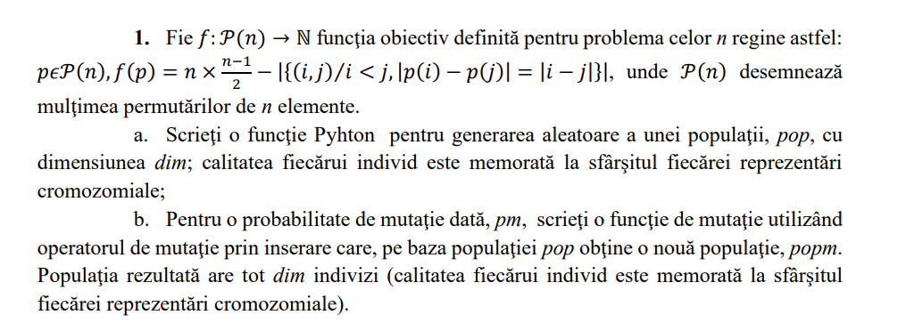

# Genetic Algorithms
Homework Repository for the Genetic Algorithms Course

Homework 1 
Problema 2. Fie problema comis-voiajorului (enunțul în manual, §5.2.1). 
Rezolvați problema utilizând un algoritm de tip hill climbing. 
Este obținută întotdeauna soluția optimă? Explicați.

Homework 2

Homework 3. 
Problema 2. Problema rucsacului în variantă continuă. Fiind date m obiecte, fiecare având asociate o
valoare și respectiv un cost de selecție, trebuie determinat un set de obiecte/fracțiuni de obiecte cu
proprietatea că este de valoare maximă (unde valoarea unei mulțimi de obiecte este definită ca
suma valorilor obiectelor care o compun) și costul (definit ca suma costurilor obiectelor setului)
este sub un prag dat, Cmax. Problema este de tip continuu pentru că pot fi selectate fracțiuni dintrun obiect, fără depășirea pragului maxim Cmax. Dezvoltați și implementați un algoritm genetic
pentru optimizarea acestei funcții.